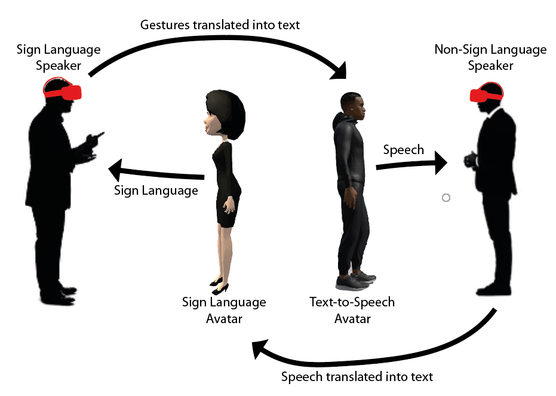

<!-- Improved compatibility of back to top link: See: https://github.com/othneildrew/Best-README-Template/pull/73 -->

<!--
*** Thanks for checking out the Best-README-Template. If you have a suggestion
*** that would make this better, please fork the repo and create a pull request
*** or simply open an issue with the tag "enhancement".
*** Don't forget to give the project a star!
*** Thanks again! Now go create something AMAZING! :D
-->

<!-- PROJECT SHIELDS -->
<!--
*** I'm using markdown "reference style" links for readability.
*** Reference links are enclosed in brackets [ ] instead of parentheses ( ).
*** See the bottom of this document for the declaration of the reference variables
*** for contributors-url, forks-url, etc. This is an optional, concise syntax you may use.
*** https://www.markdownguide.org/basic-syntax/#reference-style-links
-->

[![LinkedIn][linkedin-shield]][linkedin-url]

<!-- PROJECT LOGO -->
 

  
 
 

<h3 style="font-size:200%;" align="center"><b>Towards Augmentative Communication in Virtual Environments</b></h3>
 

<!-- ABOUT THE PROJECT -->
## About The Project

 
 
This is a proof-of-concept that aims to demonstrate <b>augmentative communication</b> between a portuguese sign language speaker and a portuguese non-sign language speaker in virtual reality.

In this project we used a portuguese text to portuguese sign language translator called <a href="https://www.inesc-id.pt/publications/15671/pdf">PE2LGP</a>, which has an avatar that executes the sign language gestures. Then for the portuguese sign language to spoken portuguese translation we captured and recognized the gestures using the <b>Meta Quest 2</b> hand tracking.

(<a href="#readme-top">back to top</a>)

### Built With

* [![Unity][Unity.js]][Unity-url]
* [![Meta][Meta.js]][Meta-url]
* [![azure][azure.js]][azure-url]

(<a href="#readme-top">back to top</a>)

<!-- USAGE EXAMPLES -->
## Usage Example

https://user-images.githubusercontent.com/32814782/209723936-055ef73e-53f7-4205-a1bd-31a301795b87.mp4

<!-- Docs -->
## Dissertation & Extended Abstract

<!-- CONTACT -->
## Contact

João Galveias - joao.galveias@tecnico.ulisboa.pt

(<a href="#readme-top">back to top</a>)

<!-- MARKDOWN LINKS & IMAGES -->
<!-- https://www.markdownguide.org/basic-syntax/#reference-style-links -->
[linkedin-shield]: https://img.shields.io/badge/-LinkedIn-black.svg?style=for-the-badge&logo=linkedin&colorB=555
[linkedin-url]: https://www.linkedin.com/in/joao-galveias/
[product-screenshot]: images/screenshot.png
[Unity.js]: https://img.shields.io/badge/unity-000000?style=for-the-badge&logo=unity&logoColor=white
[Unity-url]: https://unity.com/
[Meta.js]: https://img.shields.io/badge/meta-ffffff?style=for-the-badge&logo=Meta&logoColor=blue
[Meta-url]: https://www.meta.com/quest/
[azure.js]: https://img.shields.io/badge/azure-0769AD?style=for-the-badge&logo=microsoftazure&logoColor=white
[azure-url]: https://azure.microsoft.com/pt-pt/

